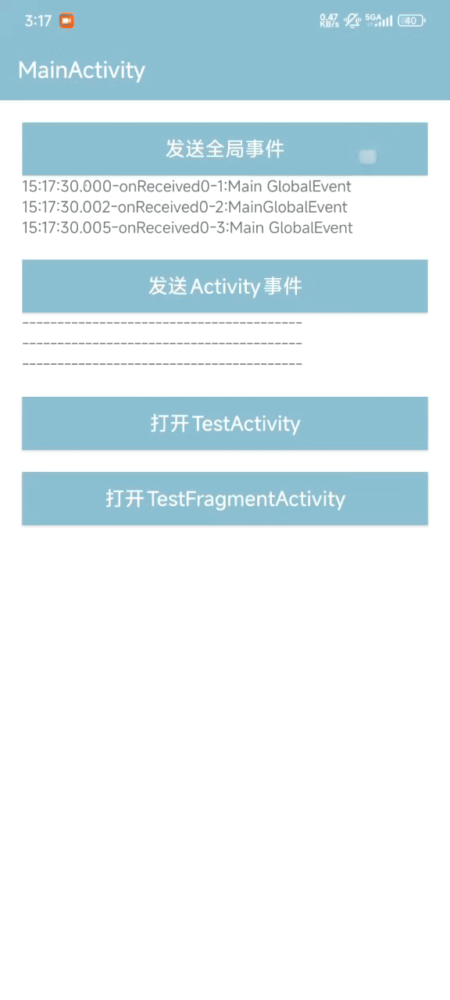

基于 Kotlin Coroutines 和 Flows 实现的 FlowBus 是一个 Kotlin 事件总线。

FlowBus支持：Sticky、切换线程、多个订阅、延迟发送、生命周期感知、有序接收消息

 优点      | 详细解释                                                                                                                                                                                                                                
---------|-------------------------------------------------------------------------------------------------------------------------------------------------------------------------------------------------------------------------------------
 实现粘性效果  | 当 replay 设置为 1 时，Flow 会缓存最近发出的 1 个值。<br>任何新的订阅者在开始收集时，会立即接收到这个缓存的值，即使该值是在订阅开始之前发布的。                                                                                                                                                 
 轻松切换线程  | 在 subscribe 方法中，使用了 lifecycleOwner.lifecycleScope.launch 并在 collect 内部再次使用 this.launch(dispatcher) 来处理接收到的事件。<br>* 收集 (Collect)：可以在任何线程（通常是主线程/Dispatchers.Main）上安全地开始/停止。<br>* 处理 (Handle)：接收到数据后，可以轻松地切换到指定的线程来执行耗时操作，避免阻塞 UI 线程。 
 多个订阅    | SharedFlow 是一种热流 (Hot Flow)，它支持多播（Multicast）。<br>同一个 Flow 实例可以被多个 collect 调用同时订阅。<br>当事件通过 tryEmit() 发布时，所有当前活跃的观察者都会同时接收到该事件。                                                                                                      
 自动清除事件  | 当一个 MutableSharedFlow 的 replay 设置为 0 时，如果没有活跃的订阅者在监听，发布事件时（通过 tryEmit 或 emit），该事件将直接被丢弃。<br>这有效地避免了事件积压（Backlog）问题，防止应用在长时间无订阅者的情况下因事件过多而导致内存占用升高。                                                                                  
 生命周期感知  | 确保只有当 lifecycleOwner (如 Activity/Fragment) 的状态 大于或等于 startState 时，repeatOnLifecycle 块内的协程（即 collect 操作）才会被启动。                                                                                                                       
 启动时机控制  | 通过传入不同的 Lifecycle.State 来控制何时开始响应事件                                                                                                                                                                                                 
 协程暂停与恢复 | 当 lifecycleOwner 的状态低于 startState 时（例如从 STARTED 到 STOPPED），repeatOnLifecycle 会自动取消其内部的 collect 协程。<br>当状态再次达到 startState 时，会自动重启一个新的 collect 协程。                                                                                    

## 引入

### Gradle:

1. 在Project的 **build.gradle** 或 **setting.gradle** 中添加远程仓库

    ```gradle
    repositories {
        //
        mavenCentral()
    }
    ```

2. 在Module的 **build.gradle** 中添加依赖项
   [](https://central.sonatype.com/artifact/io.github.logan0817/flowbus)

    ```gradle
   implementation 'io.github.logan0817:flowbus:1.0.1' // 替换为上方徽章显示的最新版本
    ```

## 效果展示


> 你也可以直接下载 [演示App](https://raw.githubusercontent.com/logan0817/FlowBus/master/app/release/app-release.apk) 体验效果


## 发送实例
```kotlin
//Global Scope
postEvent(event = GlobalEvent("Test GlobalEvent"))

//Activity Scope
postEvent(scope = requireActivity(), event = ActivityEvent("Test ActivityEvent"))

//Fragment Scope
postEvent(scope = this@TestFragment, event = FragmentEvent("Test FragmentEvent"))
```

```kotlin
//延迟发送
postEvent(GlobalEvent(value = "Delay GlobalEvent"), 1000)
```

## 订阅实例
```kotlin
/** subscribeForever
 *  在任何地方使用，需要指定 coroutineScope 中
 */
val coroutineScope = CoroutineScope(Dispatchers.Main)
coroutineScope.subscribeEvent<GlobalEvent> {

}

/** 订阅 GlobalEvent
 */
subscribeEvent<GlobalEvent> {
    
}
/** 订阅 ActivityEvent
 */
subscribeEvent<ActivityEvent>(scope = activity) {
    
}
/** 订阅 FragmentEvent
 */
subscribeEvent<FragmentEvent>(scope = fragment) {

}

```

## 切换线程实例

```kotlin
subscribeEvent<XEvent>(Dispatchers.IO) {

}
```

## 感知生命周期实例

```kotlin
subscribeEvent<XEvent>(minLifecycleState = Lifecycle.State.RESUMED) {

}
```

## 粘性方式订阅实例

```kotlin
subscribeEvent<XEvent>(isSticky = true) {

}
```

## removeStickyEvent

```kotlin

/**
 * 移除指定的粘性事件流
 */
//globalScope中
removeStickyEvent<XEvent>()
//coroutineScope中
removeStickyEvent<XEvent>(scope = coroutineScope)
//activity中
removeStickyEvent<XEvent>(scope = activity)
//fragment中
removeStickyEvent<XEvent>(scope = fragment)
```

## clearStickyEvent

```kotlin

/**
 * 清除本地粘性事件类型 T 的缓存，但保留 Flow 实例。
 */
//globalScope中
clearStickyEvent<XEvent>()
//coroutineScope中
clearStickyEvent<XEvent>(scope = coroutineScope)
//activity中
clearStickyEvent<XEvent>(scope = activity)
//fragment中
clearStickyEvent<XEvent>(scope = fragment)
```

### License

```
MIT License

Copyright (c) 2025 Logan Gan

Permission is hereby granted, free of charge, to any person obtaining a copy
of this software and associated documentation files (the "Software"), to deal
in the Software without restriction, including without limitation the rights
to use, copy, modify, merge, publish, distribute, sublicense, and/or sell
copies of the Software, and to permit persons to whom the Software is
furnished to do so, subject to the following conditions:

The above copyright notice and this permission notice shall be included in all
copies or substantial portions of the Software.

THE SOFTWARE IS PROVIDED "AS IS", WITHOUT WARRANTY OF ANY KIND, EXPRESS OR
IMPLIED, INCLUDING BUT NOT LIMITED TO THE WARRANTIES OF MERCHANTABILITY,
FITNESS FOR A PARTICULAR PURPOSE AND NONINFRINGEMENT. IN NO EVENT SHALL THE
AUTHORS OR COPYRIGHT HOLDERS BE LIABLE FOR ANY CLAIM, DAMAGES OR OTHER
LIABILITY, WHETHER IN AN ACTION OF CONTRACT, TORT OR OTHERWISE, ARISING FROM,
OUT OF OR IN CONNECTION WITH THE SOFTWARE OR THE USE OR OTHER DEALINGS IN THE
SOFTWARE.
```
